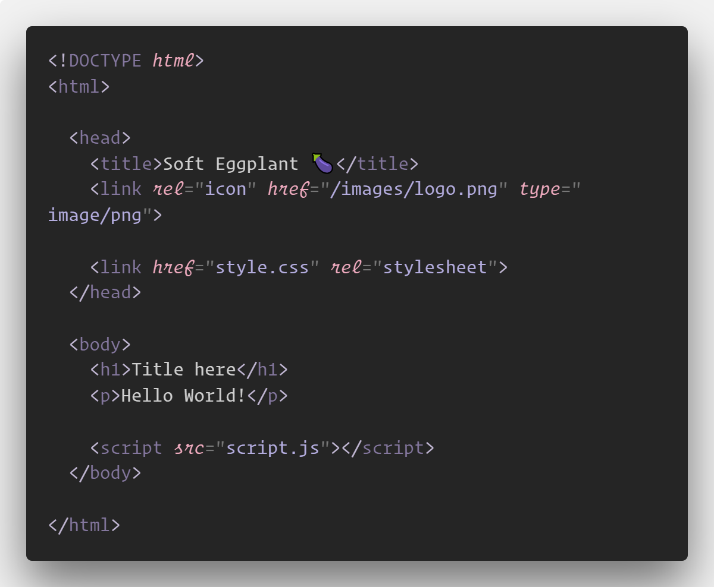
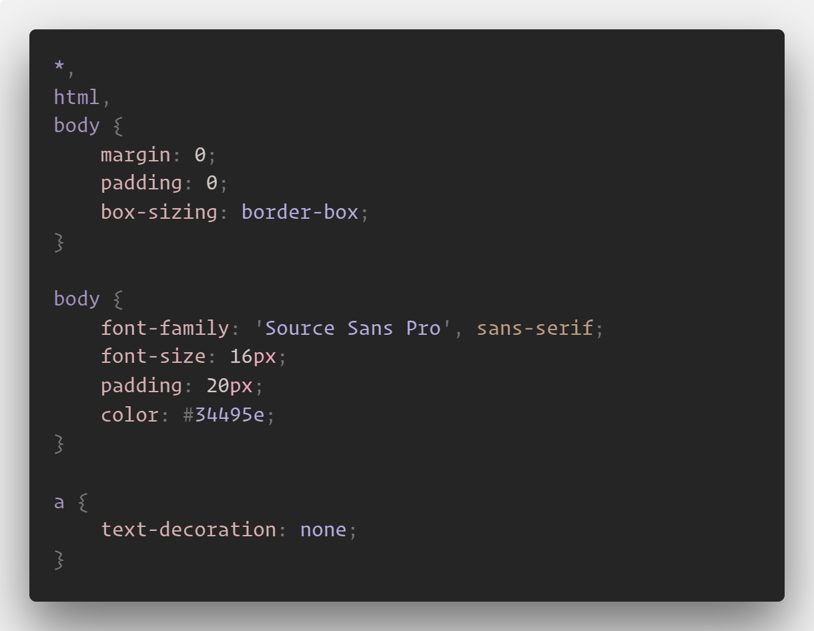
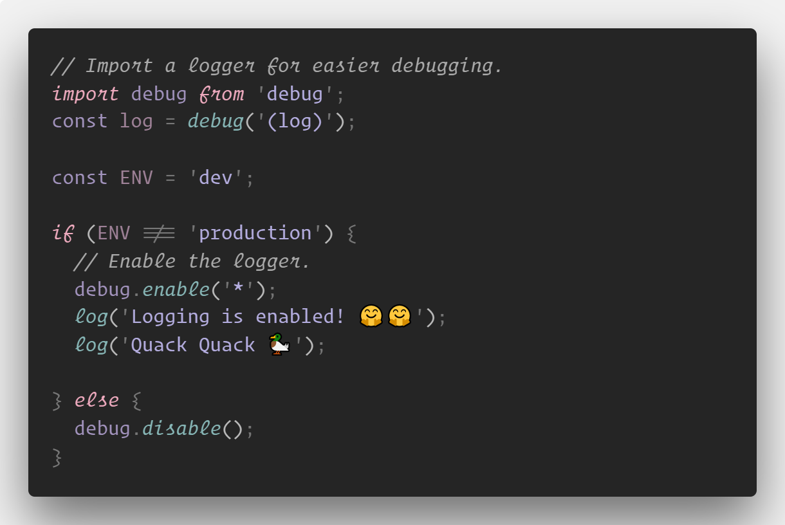
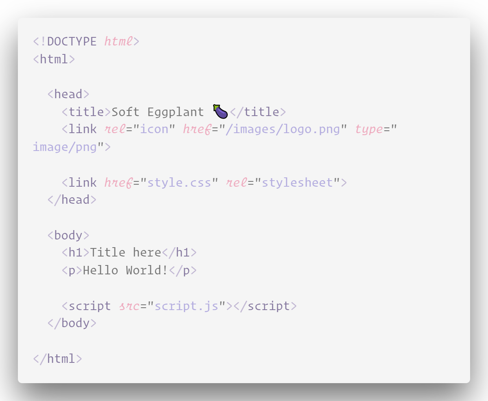
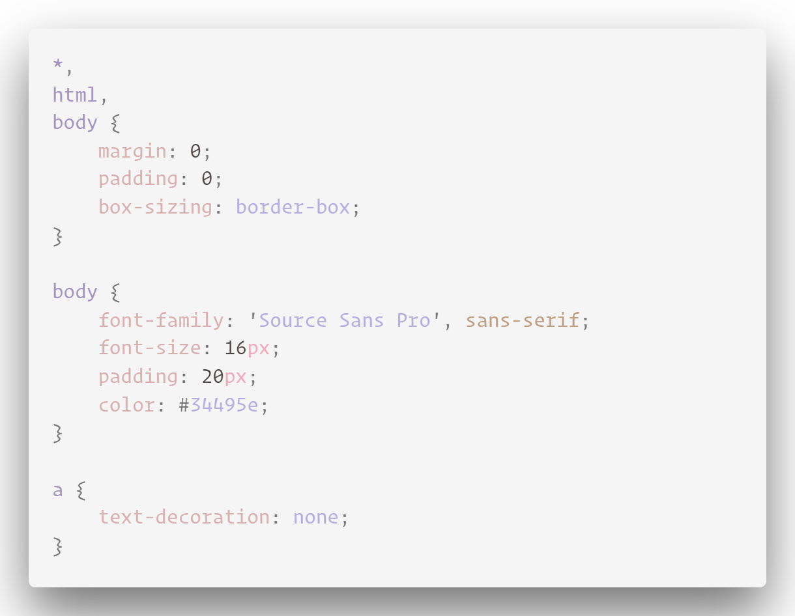
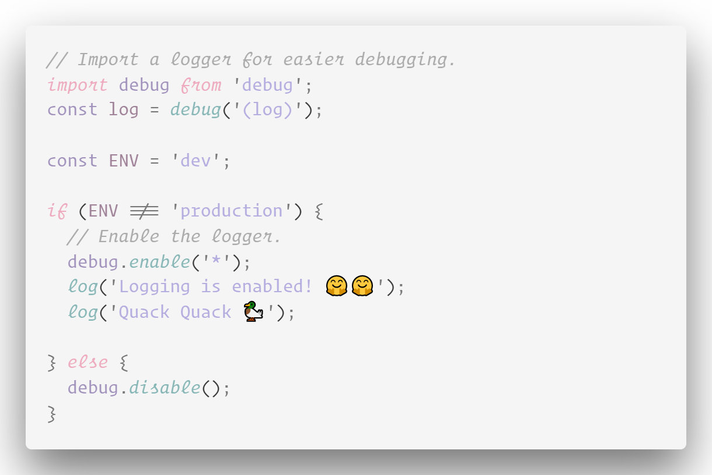

# 🍆 Soft Eggplant (Light & Dark)

A soft 🍆 colored vscode theme, originally based on the default 'Quiet Light'. Light &amp; Dark version.

The themes aren't currently published, but can be manually installed. Simply clone this repo and put the two folders in your `.vscode/extensions` folder.

## Previews

**Dark**

HTML

CSS

JS

**Light**

HTML

CSS

JS

